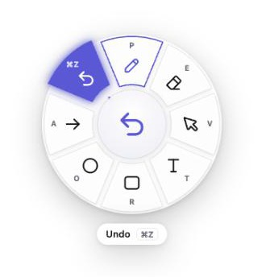
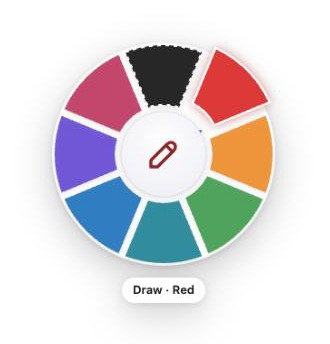
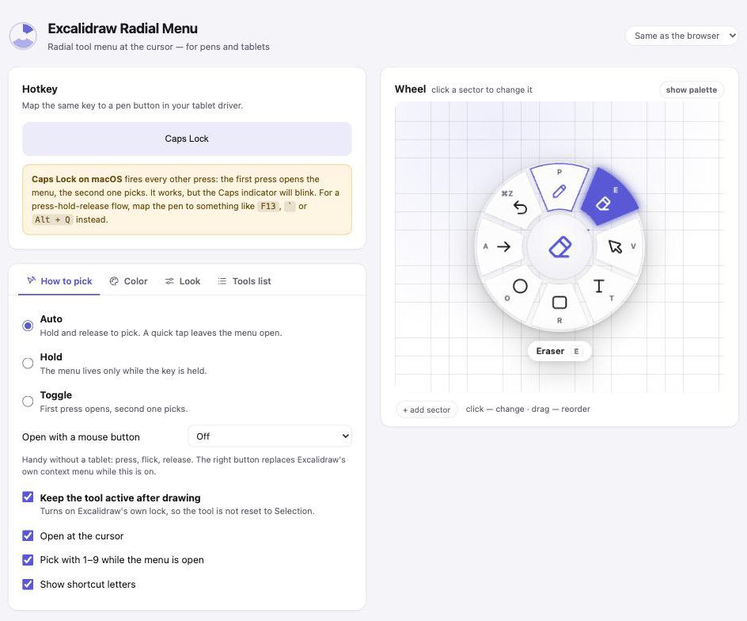

# Excalidraw Radial Menu

A radial (pie) tool menu for Excalidraw that pops up **right under the cursor** on a single
hotkey. Built for graphics tablets: press the pen button → flick in a direction → release.
No more trips to the toolbar at the top.

<p align="center">
  
  &nbsp;&nbsp;
</p>

* Picking is **by direction, not by hitting a target**: flick the pen towards a sector — the
  cursor never has to land inside the ring.
* Dead zone in the centre = cancel.
* **Color in one gesture**: hold on a drawing tool's sector and the ring collapses into the
  centre, with a palette blooming out of it. Release on a color and you get both the tool and
  the color. Move back to the centre to step back to the tools.
* **The tool stops resetting** to Selection after every shape.
* Works from the keyboard, from a pen button, or from the right mouse button.
* The menu picks up Excalidraw's own theme and accent color.
* Fully configurable: 2–14 items out of 23 actions plus your own colors.
* Configured right on the wheel — click a sector to change it, drag to reorder.
* English and Russian included; adding a language is one JSON file.

---

## Install

1. `chrome://extensions` → turn on **Developer mode** (top right).
2. **Load unpacked** → pick the `excalidraw-radial-menu` folder.
3. Open <https://excalidraw.com/> and press the hotkey.

Ready-made archive: see [Releases](../../releases) — download the zip, unpack it, then load the
folder the same way. Chrome only installs signed `.crx` files from the Web Store, so an unpacked
folder is the way to go.

Settings: the extension icon in the Chrome toolbar, or `chrome://extensions` → *Details* →
*Extension options*.

## Hotkey and the pen

The default is **Caps Lock**. Map the same key to a pen button in your tablet driver
(for Huion: *Pen Settings → Key → Keystroke*).

One catch: **on macOS, Chrome reports Caps Lock every other press** — switching it on arrives as
`keydown`, switching it off as `keyup`. The extension handles that, so "press to open, press
again to pick" works. A press-hold-release flow is impossible with Caps Lock on macOS, though —
the browser never reports that the key is being held.

If you want hold-and-release, map the pen to any other key and capture it in the settings.
Keys Excalidraw does not use:

| Key | Note |
|---|---|
| `` ` `` | free, right next to your thumb |
| `F13`–`F19` | conflict with nothing at all, if your driver can send them |
| `Alt` + `Q`, `Alt` + `W` | a safe combo when no plain key is free |
| right `Shift` / right `Alt` | caught separately from the left ones |

The capture button understands modifiers too — just press the whole combination.

## Mouse

Without a tablet the same menu works on a mouse button: **Settings → How to pick → Open with a
mouse button**. Press, flick, release — or click once and pick with a second click.

While that is on, the chosen button replaces Excalidraw's own context menu.

## Pick modes

| Mode | Behaviour |
|---|---|
| **Auto** (default) | Hold for longer than ~0.2 s and the pick happens on release. A quick tap leaves the menu open — then pick with a tap, a digit or a letter. |
| **Hold** | The menu lives strictly while the key is held. |
| **Toggle** | The first press opens, the second one picks. |

While the menu is open: `Esc` cancels, `1`–`9` pick by sector number, and a tool's own letter
(`R`, `O`, `T`…) picks it directly.

## Color

Hold the pen still on the sector of Draw, Rectangle, Ellipse, Diamond, Arrow, Line or Text
**without releasing the key** — an arc runs along the edge of the sector and after 350 ms the
tool ring collapses into the centre and a palette blooms out of it. Then it is business as
usual: flick towards a color, release. Both the tool and the color are applied.

* The arc shows which sectors have a palette and how much longer to hold.
* The countdown resets while the pen is moving, so you cannot fall into the palette by accident.
* **Move back to the centre and the palette steps back to the tools** — nothing is applied.
* Release in the centre of the palette and only the tool is applied, the color is left alone.
* `Esc` cancels everything.

The settings hold your own palette (2–14 colors, any hex), the delay before it appears
(0 turns the submenu off) and what exactly to change: stroke color or background color.

Colors can also go straight into the main wheel, alongside the tools — they are in the
"what goes here" list for every sector.

## Keeping the tool active

By default Excalidraw goes back to Selection after every single shape, which is painful when you
need five arrows in a row. **Settings → How to pick → Keep the tool active after drawing** turns
on Excalidraw's own lock whenever a tool is picked from the wheel. The extension only ever turns
the lock on, never off, so it does not fight you if you toggle it yourself.

## Configuring the wheel

Everything is edited right on the preview:

* **click a sector** — choose what goes in it (any tool, or a color from the palette);
* **drag a sector** — reorder;
* **"+ add sector"** — one more item;
* the **"show palette"** button flips the preview to the color ring, where clicking a sector
  opens a color picker and dragging reorders the palette.

The same thing is duplicated as a list below — sometimes reordering is easier there.

<p align="center"></p>

## What can go in the wheel

Tools: draw, eraser, selection, lasso, hand, rectangle, diamond, ellipse, arrow, line, text,
image, frame, laser pointer, bucket fill, draw-to-shape, web embed.
Actions: undo, redo, delete, duplicate, group, zoom to fit.
Plus any colors from your palette.

## Languages

Every visible string lives in `_locales/<lang>/messages.json`; `en` is the default. To add a
language, copy `_locales/en` to `_locales/<your-lang>`, translate the `message` values and
reload the extension — Chrome picks the folder matching the browser UI language on its own.
Nothing else needs touching.

## How it works

The extension does not reach into Excalidraw's internals and does not patch its state.

**Tools.** It dispatches to `document` exactly the `KeyboardEvent`s a real keyboard would
produce, and Excalidraw switches the tool through its own handler. The current tool is read from
`[data-testid^="toolbar-"][aria-pressed="true"]`. Lasso and web embed have no shortcut, so for
those the extension opens the "more tools" dropdown and clicks the item itself.

**Color.** It finds the right row in the properties panel (`.color-picker-container`: stroke is
identified by the `#1e1e1e` top pick, background by `transparent`), clicks its trigger to open
the stock popover, writes the color into its hex field and closes the popover with a second
click. For those ~50 ms the popover is hidden by an injected style, so there is no flash.
`Escape` is deliberately not used to close it — it would also reset the tool to Selection. This
is why any hex works, not just the five stock top picks.

**Theme** comes from the `theme--dark` class and the `--color-primary` / `--island-bg-color` CSS
variables on the `.excalidraw` container.

```
manifest.json            MV3 manifest
_locales/<lang>/         all visible strings
src/common.js            tools, icons, wheel geometry, styles (shared by menu and settings)
src/content.js           content script: hotkey, overlay, sector picking, dispatching
src/options.html/js/css  settings with a live, editable preview
src/background.js        toolbar icon click → open settings
dev/                     local test bench, not part of the extension
```

### Local development

```bash
python3 dev/serve.py          # http://127.0.0.1:8899
```

`dev/index.html` is an Excalidraw mock (toolbar, color panel, event log) with a `chrome.*` stub;
`dev/options.html` is the settings page outside the extension. Add `?lang=ru` to either to check
a translation. Rebuild the second one after editing `src/options.html`:

```bash
sed -e 's#href="options.css"#href="../src/options.css"#' \
    -e 's#src="common.js"#src="../src/common.js"#' \
    -e 's#src="options.js"#src="../src/options.js"#' \
    -e 's#<link rel="stylesheet"#<script src="chrome-stub.js"></script>\n<link rel="stylesheet"#' \
    src/options.html > dev/options.html
```

## Self-hosted Excalidraw

Add your address to `manifest.json` — to `host_permissions` and to
`content_scripts[0].matches` — and reload the extension.

## License

MIT — see [LICENSE](LICENSE). Icons are drawn to match the Excalidraw and tabler-icons style.

---

[Русская версия](README.ru.md)
